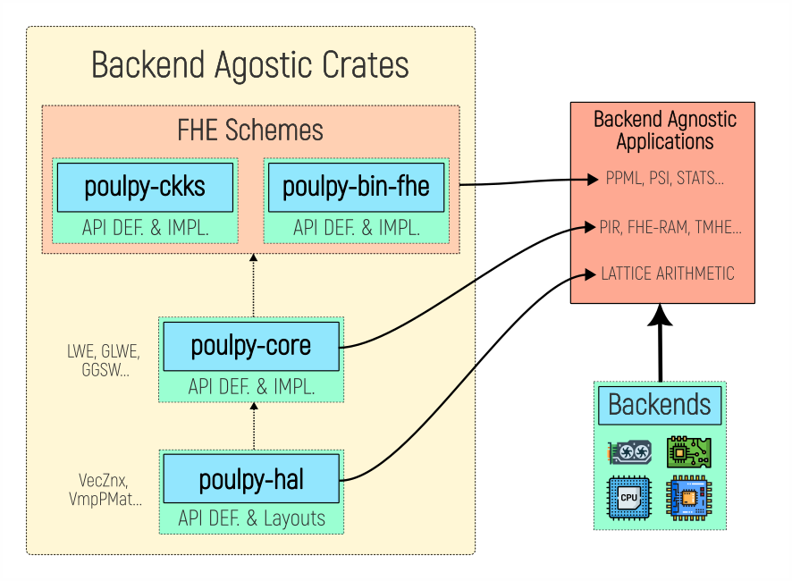

# 🐙 Poulpy

<p align="center">

</p>

[](https://github.com/poulpy-fhe/poulpy/actions/workflows/ci.yml)
[](https://github.com/google/heir/tree/main/lib/Target/Poulpy)

**Poulpy** is a **fast and modular** FHE library that implements Ring-Learning-With-Errors based homomorphic encryption over the Torus. It adopts the bivariate polynomial representation proposed in [Revisiting Key Decomposition Techniques for FHE: Simpler, Faster and More Generic](https://eprint.iacr.org/2023/771) to represent Torus polynomials. Compared with the residue number system (RNS), this representation provides simpler and more reusable arithmetic, a **common plaintext space** for all schemes, and native bridges between schemes. Poulpy also decouples scheme implementations from the polynomial arithmetic backend by being built from the ground up around a **hardware abstraction layer**. Leveraging the HAL, users can develop applications generic over the backend and choose a backend at runtime.

<p align="center">

</p>

## Library Crates

- **`poulpy-hal`**: a crate providing layouts and a trait-based hardware acceleration layer with open extension points, matching the API and types of spqlios-arithmetic. This crate does not provide concrete implementations other than the layouts (e.g. `VecZnx`, `VmpPmat`).
- **`poulpy-core`**: a backend-agnostic crate implementing scheme-agnostic Module-LWE arithmetic for LWE, GLWE, GGLWE, and GGSW ciphertexts using **`poulpy-hal`**. It can be instantiated with any backend crate (e.g. `poulpy-cpu-ref`, `poulpy-cpu-avx`).
- **`poulpy-ckks`**: a backend-agnostic leveled CKKS implementation built on **`poulpy-core`** and **`poulpy-hal`**, including polynomial evaluation and bootstrappings.
- **`poulpy-bin-fhe`**: the binary/gate-level FHE crate built on **`poulpy-core`** and **`poulpy-hal`**. It replaces the former `poulpy-schemes` crate; its public APIs have moved to the backend-owned HAL/core surface, while a few host/reference-backend dependencies remain for this release.
- **`poulpy-cpu-ref`**: the reference CPU implementation of **`poulpy-hal`**, intended for correctness and validation rather than performance-sensitive workloads.
- **`poulpy-cpu-avx`**: an AVX2/FMA accelerated CPU implementation of **`poulpy-hal`**, exposing `FFT64Avx`, `NTT4x30Avx`, and their optional Rayon-scheduled variants (`enable-rayon`).
- **`poulpy-cpu-avx512`**: an AVX-512 accelerated CPU implementation of **`poulpy-hal`**, exposing `FFT64Avx512`, `NTT4x30Avx512`, and `NTT3x42Ifma` (`enable-ifma`), plus `FFT64Avx512Rayon` and `NTT4x30Avx512Rayon` (`enable-rayon`) and `NTT3x42IfmaRayon` (`enable-rayon` with `enable-ifma`).
- **`poulpy-cpu-arm`**: a NEON/ASIMD accelerated CPU implementation of **`poulpy-hal`** for AArch64, exposing `FFT64Neon`, `NTT4x30Neon`, and their optional Rayon-scheduled variants (`enable-rayon`).
- **`poulpy-bench`**: the consolidated Criterion benchmark suite for the workspace. It is an internal workspace crate and is not published to crates.io.

## Architecture

### Crate Dependency Chain

```
poulpy-hal                  ← hardware abstraction: layouts and operation traits
└── poulpy-core              ← scheme-agnostic Module-LWE arithmetic (LWE, GLWE, GGLWE, GGSW)
    ├── poulpy-ckks           ← leveled CKKS evaluator
    └── poulpy-bin-fhe        ← binary / gate-level FHE

poulpy-cpu-ref              ← portable reference backend
poulpy-cpu-avx              ← AVX2/FMA-accelerated backend
poulpy-cpu-avx512           ← AVX-512/IFMA-accelerated backend
poulpy-cpu-arm              ← NEON/ASIMD-accelerated backend (AArch64)
```

Backend crates (`poulpy-cpu-ref`, `poulpy-cpu-avx`, `poulpy-cpu-avx512`, `poulpy-cpu-arm`, …) implement the open extension points defined in `poulpy-hal/oep`. The CKKS and core layers keep concrete backend wiring in backend crates; `poulpy-bin-fhe` still carries a few reference-backend ties in v0.6.0 while that cleanup continues.

### Layer Anatomy

Every layer (`poulpy-hal`, `poulpy-core`, `poulpy-ckks`) follows the same internal four-module pattern:

```
   ┌─────────┐     ┌─────────┐     ┌─────────────┐     ┌────────────────┐
   │   api   │────►│   oep   │────►│  delegates  │◄────│    default     │
   └─────────┘     └─────────┘     └─────────────┘     └────────────────┘
```

| Module | Role |
|--------|------|
| `api` | Public traits user code calls. Bounds reference `oep` for the backend capabilities they need. |
| `oep` | **Open Extension Points.** Unsafe backend dispatch traits (one per operation family). A blanket `impl` wires any conforming backend to the corresponding `default` method automatically. |
| `default` | Portable algorithm implementations as safe trait methods — the fallback every new backend gets for free. |
| `delegates` | Implements each `api` trait on `Module<BE>` by dispatching through `oep`. Composite operations also live here. |

### Overriding at Any Level

A backend overrides any operation by implementing the corresponding `oep` trait directly instead of relying on the blanket `default` wiring. Only the hot-path operations need overrides; everything else inherits the portable `default` implementation for free. This override mechanism is independent at every layer: a backend can override a `poulpy-hal` primitive without touching `poulpy-core` behavior, and vice versa.

### Integrating a Backend

1. Define a backend struct and implement the `Backend` trait from `poulpy-hal`.
2. For each HAL operation family, either call the blanket default or implement the OEP trait directly with a custom dispatch.
3. For each `poulpy-core` operation family, either call the corresponding `impl_*_defaults_full!` macro to inherit the portable implementation, or implement the OEP trait directly to override it.
4. Optionally, do the same for `poulpy-ckks` using the `impl_ckks_*_defaults!` macros or direct OEP trait implementations.

At every layer the macro and the direct implementation are mutually exclusive per operation family: the macro opts the backend into the portable `default` path, while a direct OEP impl replaces it entirely. There is no requirement to use the macros — a backend that needs full control can implement every OEP trait by hand.

See `poulpy-cpu-ref` for the reference implementation of all four steps.

### Testing a Backend

A new backend does not re-implement the tests. `poulpy-hal` and `poulpy-core` ship theirs as functions generic over the backend type; a backend instantiates them with a macro and a parameter set, and inherits the conformance checks.

`poulpy-hal` covers the arithmetic primitives (`vec_znx`, `vec_znx_dft`, `vec_znx_big`, `svp`, `vmp`, convolution, serialization, word compatibility) through two macros. `backend_test_suite!` validates one backend against the specification; `cross_backend_test_suite!` runs the same operation on a reference backend and on the backend under test and compares.

`poulpy-core` splits its suites by the question each answers, and neither subsumes the other:

* `core_backend_test_suite!` (**noise**) encrypts, operates, decrypts, and compares the residual noise against the analytic bound: *does this backend implement the scheme?* Verification reads coefficients, so it is host-only.
* `core_parity_test_suite!` (**parity**) runs one operation on a reference backend and on the backend under test over identical uniform inputs, and asserts byte equality: *does this backend agree with the reference?* It needs no secrets, encryption or noise model, so a device backend can run it.

A bound is a weak oracle: a gadget-product accumulator one limb too narrow passes the key-switch noise sweep comfortably. Byte equality is not weak, but on its own it cannot tell you the reference is right.

Coverage degrades rather than switching off. A backend with a narrower envelope restricts the sweep through `ParityShapes` (rank 1 only, a single `dsize`) instead of dropping the suite, and parity holds across families: `NTT3x42Ifma` is checked against `NTT4x30Ref`.

| | `poulpy-cpu-ref` | `poulpy-cpu-avx` | `poulpy-cpu-avx512` | `poulpy-cpu-arm` |
| --- | --- | --- | --- | --- |
| HAL, per backend | yes | yes | yes | yes |
| HAL, cross backend | `NTT4x30Ref` vs `FFT64Ref` | vs `poulpy-cpu-ref` | vs `poulpy-cpu-ref` | vs `poulpy-cpu-ref` |
| Core noise | `FFT64Ref`, `NTT4x30Ref` | — | — | — |
| Core parity | reference side | FFT64, NTT4x30 | FFT64, NTT4x30, NTT3x42Ifma | FFT64, NTT4x30 |

The noise suite runs in `poulpy-cpu-ref` alone: the scheme-level model is backend-independent, so an accelerated backend proves itself by byte-parity against the reference rather than by re-running the model.

## Bivariate Polynomial Representation

Existing FHE implementations (such as [Lattigo](https://github.com/tuneinsight/lattigo) or [OpenFHE](https://github.com/openfheorg/openfhe-development)) use the [residue number system](https://en.wikipedia.org/wiki/Residue_number_system) (RNS) to represent large integers. Although the parallelism and carry-less arithmetic offered by the RNS representation provide efficient modular arithmetic over large integers, RNS also has drawbacks in the context of FHE. The main idea behind the bivariate representation is to decouple cyclotomic arithmetic from large-number arithmetic. Instead of using the RNS representation for large integers, integers are decomposed in base $2^{-K}$ over the Torus $\mathbb{T}_{N}[X]$.

This provides the following benefits:

- **Intuitive, efficient, and reusable parameterization and instances:** Only the bit size of the modulus is required from the user (i.e. Torus precision). Parameterization is therefore natural and generic, and instances can be reused for any circuit consuming the same homomorphic capacity without loss of efficiency. With the RNS representation, individual NTT-friendly primes need to be specified for each level, making parameterization less user friendly and more circuit specific.

- **Optimal and granular rescaling:** Ciphertext rescaling is carried out with bit shifts, enabling bit-level rescaling and precise noise/homomorphic-capacity management. In the RNS representation, ciphertext division can only be done by one of the primes composing the modulus, making scale management more difficult and often less efficient.

- **Linear number of DFTs in the half external product:** The bivariate representation of the coefficients implicitly provides the digit decomposition. As a result, the number of DFTs is linear in the number of limbs, unlike in the RNS representation where it is quadratic due to RNS basis conversion. This enables much more efficient key switching, which is one of the **most used and expensive** FHE operations.

- **Unified plaintext space:** The bivariate polynomial representation is, by nature, a high-precision discretized representation of the Torus $\mathbb{T}_{N}[X]$. Using the Torus as the common plaintext space for all schemes follows the vision of [CHIMERA: Combining Ring-LWE-based Fully Homomorphic Encryption Schemes](https://eprint.iacr.org/2018/758): unifying Module-LWE-based FHE schemes (TFHE, FHEW, BGV, BFV, CLPX, GBFV, CKKS, ...) under a single scheme with different encodings, enabling native and efficient scheme switching.

- **Simpler implementation:** Since cyclotomic arithmetic is decoupled from the coefficient representation, the same pipeline (including DFT) can be reused for all limbs, unlike in the RNS representation. The bivariate representation also has a straightforward flat, aligned, and vectorized memory layout. These properties make it a strong target for hardware acceleration.

- **Deterministic computation:** Although it is defined on the Torus, bivariate arithmetic remains integer polynomial arithmetic, ensuring all computations are deterministic. Outputs are reproducible and identical regardless of the backend or hardware (even when using floating point).

The bivariate representation recovers bit-granular scale and capacity management that RNS-CKKS lacks. A recent RNS-based technique, [Grafting](https://eprint.iacr.org/2024/1014) by Cheon et al., targets the same goal from inside the RNS world by decoupling scale factors from the modulus. For a detailed comparison of the two approaches, see [docs/grafting-vs-bivariate.md](docs/grafting-vs-bivariate.md).

## Installation

- **`poulpy-hal`**: https://crates.io/crates/poulpy-hal
- **`poulpy-core`**: https://crates.io/crates/poulpy-core
- **`poulpy-ckks`**: https://crates.io/crates/poulpy-ckks
- **`poulpy-bin-fhe`**: https://crates.io/crates/poulpy-bin-fhe
- **`poulpy-cpu-ref`**: https://crates.io/crates/poulpy-cpu-ref
- **`poulpy-cpu-avx`**: https://crates.io/crates/poulpy-cpu-avx
- **`poulpy-cpu-avx512`**: https://crates.io/crates/poulpy-cpu-avx512
- **`poulpy-cpu-arm`**: https://crates.io/crates/poulpy-cpu-arm

For example, a CKKS application can depend on:

```toml
[dependencies]
poulpy-ckks = "0.8.0"
poulpy-cpu-ref = "0.8.0"
```

For binary FHE:

```toml
[dependencies]
poulpy-bin-fhe = "0.8.0"
poulpy-cpu-ref = "0.8.0"
```

## Documentation

* The [`docs/`](./docs) folder holds the full documentation: a codebase map, the backend guide, design notes, and architecture diagrams. Start with its [index](./docs/README.md).
* Crate package pages and generated Rust documentation are linked from the crates.io entries above.
* Crate-specific READMEs provide more focused usage notes, especially [`poulpy-ckks`](./poulpy-ckks/README.md) and [`poulpy-bench`](./poulpy-bench/README.md).

## Built with Poulpy

Projects building on Poulpy. Open a pull request to add yours.

**Function evaluation**

- [`poulpy-libm`](https://github.com/poulpy-fhe/poulpy-libm): homomorphic evaluation of libm-style mathematical functions on CKKS ciphertexts, built on `poulpy-ckks`'s Remez approximation planning.

**Private information retrieval**

- [`poulpy-pir`](https://github.com/poulpy-fhe/poulpy-pir): single-server, communication-efficient PIR with server-side preprocessing, implementing both constructions of [InsPIRe](https://eprint.iacr.org/2025/1352) in the CRS model.
- [`eth-pir`](https://github.com/poulpy-fhe/eth-pir): PIR over Ethereum token balances, built on `poulpy-pir`.
- [`poulpy-eth-pir-demo`](https://github.com/poulpy-fhe/poulpy-eth-pir-demo): live demo querying USDT and USDC balances on Ethereum mainnet privately.

**Compilers**

- [HEIR](https://github.com/google/heir): Google's MLIR-based FHE compiler, carrying a Poulpy dialect and a [Poulpy emitter](https://github.com/google/heir/tree/main/lib/Target/Poulpy) that translates compiled circuits to Poulpy Rust.

**Wrappers and bindings**

- [`squid`](https://github.com/cedoor/squid): an ergonomic Rust wrapper over `poulpy-bin-fhe`'s gate-level integer arithmetic, with browser and Node bindings (WebAssembly and napi-rs). [Live demo](https://squid.cedoor.dev/).

## Testing Backend-Gated Integrations

Scheme crate APIs are available when those crates are imported. Backend-owned
integration tests remain feature-gated so default workspace builds stay light:

```sh
cargo test -p poulpy-core
cargo test -p poulpy-ckks
cargo test -p poulpy-cpu-ref --features enable-core
cargo test -p poulpy-cpu-ref --features enable-ckks
cargo test -p poulpy-bin-fhe --features enable-bin-fhe
```

Benchmark targets are split by family:

```sh
cargo check -p poulpy-bench --all-targets --features hal-bench
cargo check -p poulpy-bench --all-targets --features core-bench
cargo check -p poulpy-bench --all-targets --features bin-fhe-bench
cargo check -p poulpy-bench --all-targets --features ckks-bench
```

## Contributing

We welcome external contributions, please see [CONTRIBUTING](./CONTRIBUTING.md).

## Security

Please see [SECURITY](./SECURITY.md).

## License

Poulpy is licensed under the Apache-2.0 License. See [NOTICE](./NOTICE) & [LICENSE](./LICENSE).

## Acknowledgements

**Poulpy** was initially incubated by [PhantomZone](https://phantom.zone/) with grants from [Ethereum Foundation](https://ethereum.foundation/) and [ENS Foundation](https://docs.ens.domains/dao/foundation/).

Poulpy is now actively supported, funded, and developed by [PhantomZone](https://phantom.zone/), together with [Ideal Rings Lab](https://idealringslab.com) and other contributors.

## Contact

Consider joining our [telegram](https://t.me/+uy7_HADsdN1jNmU1) group for any questions or discussions. We also have a channel on the FHE.org discord.

For anything better suited to a direct exchange, reach the organisation administrator at [jean-philippe.bossuat@idealringslab.com](mailto:jean-philippe.bossuat@idealringslab.com).

## Citing
Please use the following BibTeX entry for citing Poulpy:

    @misc{poulpy,
        title = {Poulpy v0.8.0},
        author = {Jean-Philippe Bossuat and Jules Dumezy and Rasoul Akhavan Mahdavi and Janmajaya Mall and Cedoor and Luis Ruiz-Lopez and Christian Mouchet},
        affiliation = {Jean-Philippe Bossuat: Ideal Rings Lab and PhantomZone; Jules Dumezy: CEA-List, Universit{\'e} Paris-Saclay; Rasoul Akhavan Mahdavi: University of Waterloo; Janmajaya Mall: PhantomZone; Cedoor: Independent contributor; Luis Ruiz-Lopez: University of Waterloo; Christian Mouchet: Independent contributor},
        howpublished = {Online: \url{https://github.com/poulpy-fhe/poulpy}},
        month = August,
        year = 2026,
    }
