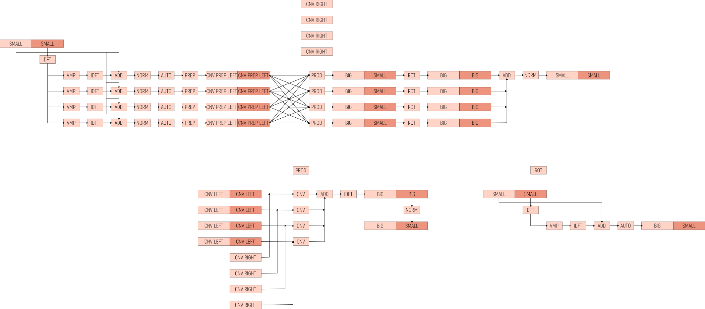

# Linear Transformations in Poulpy

This document describes how Poulpy evaluates a linear map on an encrypted vector.
It covers the global method, the baby-step giant-step decomposition, the way the work is laid out and reused, the split strategies, and a table of the cost in key-switches and modulus.

## Overview

Given a matrix `M` acting on the slots and a ciphertext encrypting a slot vector `v`, a linear transformation produces a ciphertext encrypting `M · v`.
This is the matrix-vector product underlying operations such as `CoeffsToSlots` and `SlotsToCoeffs`.

A slot-domain linear map is a sum of diagonals times rotations:

```text
M · v = Sum_i u_i (.) rot(v, i)
```

where `u_i` is the `i`-th generalized diagonal of `M` (a slot vector, `u_i[l] = M[l, l + i mod m]`), `(.)` is the slot-wise plaintext times ciphertext product, and `rot(v, i)` is the cyclic slot rotation by `i`, realized homomorphically by a key-switched ring automorphism.
The naive cost is one rotation, hence one key-switch, per non-zero diagonal.
Poulpy uses the Baby-Step Giant-Step decomposition to reduce that to the square root of the number of diagonals, and evaluates the whole transform for a single rescale.

The evaluation engine lives in `poulpy-core` and is scheme agnostic.
It operates on GLWE ciphertexts, GGLWE automorphism keys, and prepared plaintext diagonals through the `GLWELinearTransformations` trait.
The CKKS layer in `poulpy-ckks` is a thin wrapper, `LinearTransformationOps`, that owns the scale and budget accounting, encodes the diagonals, and supplies the galois-element to key map.
No homomorphic arithmetic lives in the CKKS layer.

## Baby-Step Giant-Step factorization

Pick a baby-step count `n1`.
Every diagonal index is factored as `i = n1 * j + k`, with the baby index `k` in `[0, n1)` and the giant index `j` in `[0, n2)`, where `n2 = ceil((max_i + 1) / n1)`.
Because rotation composes additively and distributes over the slot-wise product, the map regroups as

```text
M · v = Sum_j rot( Sum_k uu_{j,k} (.) rot(v, k),  n1 * j )

  uu_{j,k} = rot( u_{n1*j + k}, -n1 * j )      pre-rotated diagonals
```

The inner sum over `k` is the per-giant-step product, and the outer rotation by `n1 * j` followed by accumulation is the giant step.
The pre-rotated diagonals `uu_{j,k}` are plaintexts, encoded and prepared once at setup.

Two rotation families remain.
The `n1` baby-step rotations `rot(v, k)` are computed once and reused by every giant step.
The `n2` giant-step rotations `rot(., n1 * j)` are applied once per giant step.
This replaces one rotation per diagonal with `(n1 - 1) + (n2 - 1)` rotations, minimized when `n1` and `n2` are both close to the square root of the number of diagonals.

The example below shows a transform with diagonals at indexes `0, 1, 2, 4, 5, 8` and a baby-step count of `3`.

```text
diagonals : i in { 0, 1, 2, 4, 5, 8 }        n1 = 3

i = n1 * j + k                                factor each index
  0 -> j=0 k=0      1 -> j=0 k=1      2 -> j=0 k=2
  4 -> j=1 k=1      5 -> j=1 k=2      8 -> j=2 k=2

baby rotations  : rot(v, k) for k in { 0, 1, 2 }     shared by all giant steps
giant steps     : j = 0 over k in { 0, 1, 2 }
                  j = 1 over k in { 1, 2 }
                  j = 2 over k in { 2 }
```

Only the `(j, k)` pairs that correspond to a real diagonal are kept, so empty baby or giant steps never appear and never need a key.

## Algorithm

The evaluation has three phases.

In the baby-step phase the input is rotated into the `n1` baby rotations `rot(v, k)`, each prepared as a left convolution operand that is reused across every giant step.
The input mask is transformed into the convolution domain once and reused by every baby rotation, so the only per-rotation cost is the key-switch against that rotation's automorphism key.
The rotation `k = 0` is the identity and is prepared directly from the input, with no key-switch.

In the giant-step phase each giant step `j` first forms its product, the inner sum `Sum_k uu_{j,k} (.) rot(v, k)`, by convolving each baby rotation with its prepared diagonal and accumulating in the transform domain.
The product is then rotated by `n1 * j` and folded into a running accumulator.
The giant rotation `j = 0` is the identity and is folded in directly, with no key-switch.

In the finalize phase the accumulator is normalized once into the output ciphertext.

The accumulator carries the body and the mask in an un-normalized extended-precision form across the whole giant-step loop.
The body is never normalized between steps; only the mask is dropped to normalized limbs where a giant key-switch needs them, because gadget decomposition requires limb-aligned input.
A single normalization at the end produces the result, so the whole transform consumes one rescale level.



The diagram reads left to right.
The top row is the baby-step pipeline: the input mask is transformed once (DFT), each baby rotation is a key-switch (VMP, IDFT, add body, normalize, automorphism) prepared as a left convolution operand, and the crossbar feeds those rotations into the per-giant products.
Each product (PROD) is then rotated (ROT) and accumulated, with one normalization at the far right.
The lower-left inset details a single product as a sum of convolutions, and the lower-right inset details a single giant rotation.

## Prepared and streamed diagonals

The diagonals are the right operand of the evaluation.
They can be materialized once into a prepared cache of convolution operands, which is the fast path for a transform evaluated many times, or streamed, where each diagonal is prepared on the fly into a single reused scratch buffer.
The streamed path trades compute for a smaller resident footprint and suits memory-bound backends.
Both paths share the same giant-step loop and differ only in how each product obtains its diagonals.
The baby-step cache is prepared once either way.

## Split strategies

The decomposition is controlled by the choice of `n1`.

- `Direct` uses one giant step per diagonal and no baby rotations. It is best for a handful of diagonals.

- `Bsgs { giant_step }` uses a caller-fixed `n1`. This is the knob to align `n1` with the diagonal structure of `M`, for example the stride of an FFT matrix.

- `Auto` falls back to `Direct` for two diagonals or fewer, and otherwise picks `n1` automatically. It only considers giant steps that are multiples of the smallest gap between consecutive diagonals, which is cheap for stride structured matrices, and selects the one that balances the baby and giant counts near the square root of the number of diagonals.

The result is invariant to `n1`; only the cost changes, and it bottoms out near the square root of the number of diagonals.

## Cost

For a transform whose non-zero diagonals factor as `n1` baby steps by `n2` giant steps:

| Quantity | Count |
| --- | --- |
| Input transform for hoisting | 1 |
| Baby-step key-switches | n1 - 1 |
| Plaintext convolutions | one per non-zero diagonal |
| Giant-step key-switches | n2 - 1 |
| Output normalizations | 1 |
| Rescale levels consumed | 1 |
| Distinct automorphism keys | (n1 - 1) + (n2 - 1), minus empty steps |

The total number of key-switches is `(n1 - 1) + (n2 - 1)`, minimized when `n1` and `n2` are both close to the square root of the number of diagonals.

The laziness that keeps the accumulator un-normalized has one limit.
The accumulator absorbs the `n1`-term product sum and the `n2`-term giant sum without normalizing, so for a large `n1 * n2` and a small base, the caller must check that the accumulation fits the backend's extended-precision scalar.
