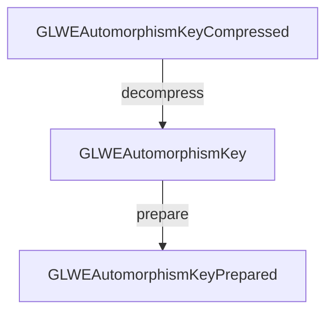

# 🐙 Poulpy-Core

**Poulpy-Core** is a Rust crate built on **`poulpy-hal`**, providing scheme- and backend-agnostic Module-LWE-based homomorphic encryption building blocks.

## Getting Started

`poulpy-core` exposes its public API as soon as the crate is imported. Backend
crates own the feature flags that wire concrete implementations into that API.

```sh
cargo test -p poulpy-core
```

The backend conformance tests are instantiated by backend crates. To run the
portable reference backend core suite:

```sh
cargo test -p poulpy-cpu-ref --features enable-core
```

`poulpy-core` is backend-agnostic. Backend crates provide the `BE` used by
`poulpy_hal::layouts::Module<BE>` and opt into portable reference compositions
one operation family at a time. The public traits live in `poulpy_core::api`;
`poulpy-cpu-ref/examples/core_encryption.rs` is a runnable example.

## Crate organization

```text
public api → delegates → OEP contract → backend implementation
                               ↑
                     portable reference composition
                               ↓
                          minimal HAL
```

| Module | Role |
|--------|------|
| `api` | Safe public operations on ciphertexts, plaintexts and keys. |
| `delegates` | Dispatches public operations through the appropriate OEP contract. |
| `oep` | Defines backend implementation contracts and explicit reference opt-in macros. |
| `reference` | Independently callable portable compositions of HAL operations. |
| `test_suite` | Shared parity, sampling and scheme/noise contract tests instantiated by backend crates. |

A backend implements an abstract `*Reference` family and forwards unchanged
methods to their reference compositions. The `impl_*_reference_full!` macros
provide the all-reference implementation of each family. Public dispatch reaches
that implementation through the corresponding `*Impl` trait. Composition traits
collect the HAL operations needed to call a reference body; they do not grant an
implementation automatically. Sampling and digit-product kernels are direct
backend extension points. See the [OEP rustdoc](src/oep/mod.rs) and
[operation contracts](docs/core-contracts.md) for the exact boundaries and
exceptions, including the caller-provided BSGS arithmetic policy. The
[compiled backend example](../poulpy-cpu-ref/src/tests/delegating_backend.rs)
replaces one operation, forwards its assign/scratch companions, and verifies
that public dispatch reaches the override. It also exercises a direct `*Impl`
implementation without opting into the matching reference trait.

Backend-specific fusion and representations belong in backend crates. Some
reference digit-product/external-product bodies require
`Backend::DFT_LIMBS_CONTIGUOUS`; their compile-time guards identify the operation
to override when an alternate layout cannot provide partial limb views. Generic
execution transfers logical inputs and outputs through the HAL; host-only noise
diagnostics remain separate.

Deterministic parity uses an explicit portable CPU reference execution on the
same logical inputs. Each backend prepares its own keys and allocates its own
advertised scratch budget; tests compare integer results and metadata, never
opaque prepared bytes. Sampling allows backend-specific random streams. Seeded
reproducibility and statistical contracts are tested separately from encryption
composition parity using controlled sampled inputs.

## Layouts

This crate defines three categories of layouts for `LWE`, `GLWE`, `GGLWE`, and `GGSW` objects (and their derivatives), all instantiated using **`poulpy-hal`** layouts. Each serves a distinct purpose:

* **Standard** → Front-end, serializable layouts. These are backend-agnostic and act as inputs/outputs of computations (e.g., `GLWEAutomorphismKey`).
* **Compressed** → Compact serializable variants of the standard layouts. They are not usable for computation but significantly reduce storage size (e.g., `GLWEAutomorphismKeyCompressed`).
* **Prepared** → Backend-optimized, opaque layouts prepared for backend-specific computation. These store preprocessed data for efficient execution on a specific backend (e.g., `GLWEAutomorphismKeyPrepared`).

Host-resident **standard** and **compressed** layouts provide `WriterTo` and `ReaderFrom` implementations where their data supports host access, allowing serialization with `Write` and `Read`:

```rust
pub trait WriterTo {
    fn write_to<W: Write>(&self, writer: &mut W) -> Result<()>;
}

pub trait ReaderFrom {
    fn read_from<R: Read>(&mut self, reader: &mut R) -> Result<()>;
}
```

### Example Workflow



Use the module factories to allocate standard and prepared objects. Given a
compressed automorphism key and `module: &Module<BE>`:

```rust,ignore
let mut key = module.glwe_automorphism_key_alloc_from_infos(&compressed);
module.decompress_automorphism_key(&mut key, &compressed);
let mut prepared = module.glwe_automorphism_key_prepared_alloc_from_infos(&key);
let mut scratch = ScratchOwned::<BE>::alloc(
    module.glwe_automorphism_key_prepare_tmp_bytes(&key),
);
module.glwe_automorphism_key_prepare(&mut prepared, &key, &mut scratch.borrow());
```

The relevant traits come from `poulpy_core::layouts`, and scratch allocation and
borrowing traits come from `poulpy_hal::api`.

---

## Encryption & Decryption

* **Encryption** → Secret-key encryption for LWE, GLWE, GGLWE, GGSW and the
  evaluation/switching keys exposed by `api::encryption`; public-key encryption
  for GLWE. Compressed encryption is exposed for GLWE, GGLWE, GGSW,
  automorphism/switching/tensor keys and GGLWE-to-GGSW keys. Other compressed
  layouts, including `LWECompressed`, provide decompression without a matching
  public compressed-encryption operation.
* **Decryption** → Available for `LWE`, `GLWE`, LWE matrices and GLWE tensors.
  `GGLWE` and `GGSW` objects contain GLWE entries that can be decrypted individually.

```rust
let mut atk = module.glwe_automorphism_key_alloc_from_infos(&key_layout);
module.glwe_automorphism_key_encrypt_sk(&mut atk, ...);
module.glwe_decrypt(&atk.at(row, 0), ...);
```
## Keyswitching, Automorphism & External Product

Keyswitching, automorphisms and external products are supported for all ciphertext types where they are well-defined.
This includes subtypes such as `GLWEAutomorphismKey`.

For example:

```rust
module.glwe_external_product(...);
module.ggsw_automorphism(...);
```

---

## Additional Features

* Ciphertexts: `LWE` and `GLWE`
* `GLWE` ring packing
* `GLWE` trace
* Noise analysis for `GLWE`, `GGLWE`, `GGSW`
* Basic operations over `GLWE` ciphertexts and plaintexts

---

## Tests

Shared backend conformance suites are available in [`src/test_suite`](./src/test_suite).
Concrete backend crates instantiate the noise/sampling suite through
`core_backend_test_suite!` and deterministic parity through
`core_parity_test_suite!`. The CPU reference crate supplies the controlled
sampling fixture for randomized composition parity; `poulpy-core` itself remains
free of concrete backend dependencies. The [operation contracts](docs/core-contracts.md)
describe the tested semantics and backend coverage.

Useful commands:

```sh
cargo test -p poulpy-core
cargo test -p poulpy-cpu-ref --features enable-core
```
