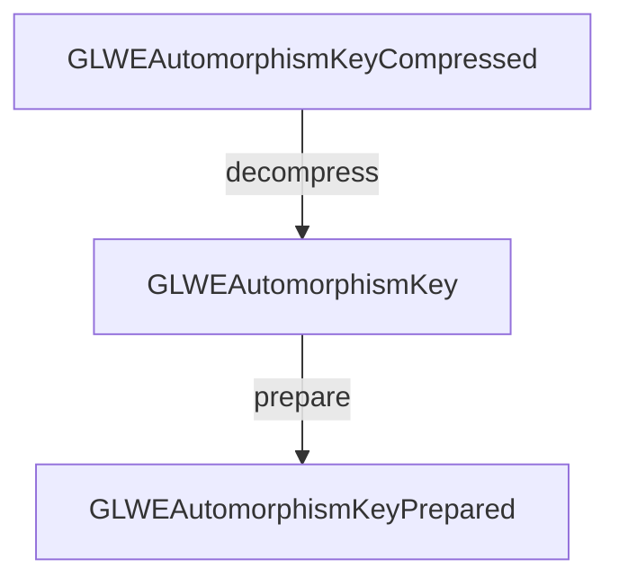

# 🐙 Poulpy-Core

**Poulpy-Core** is a Rust crate built on **`poulpy-hal`**, providing scheme- and backend-agnostic Module-LWE-based homomorphic encryption building blocks.

## Getting Started

`poulpy-core` exposes its public API as soon as the crate is imported. Backend
crates own the feature flags that wire concrete implementations into that API.

```sh
cargo test -p poulpy-core
```

The backend conformance tests are instantiated and run by the crates that
provide the implementations.

`poulpy-core` is backend-agnostic. Backend crates provide the `BE` used by
`poulpy_hal::layouts::Module<BE>` and select reference implementations or derived defaults
one operation family at a time. The public traits live in `poulpy_core::api`.

## Crate organization

```text
public API → delegates → backend *Impl
                            ├─ reference → HAL operations
                            └─ derived   → other core operations
```

| Module | Role |
|--------|------|
| `api` | Safe public operations on ciphertexts, plaintexts and keys. |
| `delegates` | Dispatches public operations through the backend's `*Impl` traits. |
| `oep` | Defines backend hooks, derived defaults and explicit opt-in macros. |
| `reference` | Reusable algorithms built from HAL operations. |
| `test_suite` | Shared parity, sampling and scheme/noise tests instantiated by backend crates. |

Core follows HAL's distinction between reference and derived implementations.
`GLWERotateReference` rotates each ciphertext polynomial through HAL.
GGSW rotation is derived from GLWE rotation on each row, so it uses the backend's
selected GLWE rotation.

Backends implement `*Impl` traits directly. Family macros can supply the
reference methods; derived methods already have default bodies. Derived helpers
are crate-private and are selected through those defaults. Reusing a
reference helper does not automatically select it for public dispatch. A backend
can replace one method and forward its companions to the reference helper.
See the [OEP rustdoc](src/oep/mod.rs) and [backend guide](docs/core-contracts.md).

Backend-specific fusion and representations belong in backend crates. Some
reference digit-product/external-product bodies require
`Backend::DFT_LIMBS_CONTIGUOUS`; their compile-time guards identify the operation
to override when an alternate layout cannot provide partial limb views. Generic
execution transfers logical inputs and outputs through the HAL; host-only noise
diagnostics remain separate.

Parity compares caller-selected backends on the same logical inputs. A validated
backend can bootstrap another for the same operations and parameter ranges.
Each backend prepares its own keys and allocates its own
advertised scratch budget; tests compare integer results and metadata, never
opaque prepared bytes. Sampling allows backend-specific random streams. Seeded
reproducibility and statistical contracts are tested separately from encryption
composition parity using controlled sampled inputs.

## Layouts

This crate defines three categories of layouts for `LWE`, `GLWE`, `GGLWE`, and `GGSW` objects (and their derivatives), all instantiated using **`poulpy-hal`** layouts. Each serves a distinct purpose:

* **Standard** → Front-end, serializable layouts. These are backend-agnostic and act as inputs/outputs of computations (e.g., `GLWEAutomorphismKey`).
* **Compressed** → Compact serializable variants of the standard layouts. They are not usable for computation but significantly reduce storage size (e.g., `GLWEAutomorphismKeyCompressed`).
* **Prepared** → Backend-optimized, opaque layouts prepared for backend-specific computation. These store preprocessed data for efficient execution on a specific backend (e.g., `GLWEAutomorphismKeyPrepared`).

Host-resident **standard** and **compressed** layouts provide `WriterTo` and `ReaderFrom` implementations where their data supports host access, allowing serialization with `Write` and `Read`:

```rust
pub trait WriterTo {
    fn write_to<W: Write>(&self, writer: &mut W) -> Result<()>;
}

pub trait ReaderFrom {
    fn read_from<R: Read>(&mut self, reader: &mut R) -> Result<()>;
}
```

### Example Workflow



Use the module factories to allocate standard and prepared objects. Given a
compressed automorphism key and `module: &Module<BE>`:

```rust,ignore
let mut key = module.glwe_automorphism_key_alloc_from_infos(&compressed);
module.decompress_automorphism_key(&mut key, &compressed);
let mut prepared = module.glwe_automorphism_key_prepared_alloc_from_infos(&key);
let mut scratch = ScratchOwned::<BE>::alloc(
    module.glwe_automorphism_key_prepare_tmp_bytes(&key),
);
module.glwe_automorphism_key_prepare(&mut prepared, &key, &mut scratch.borrow());
```

The relevant traits come from `poulpy_core::layouts`, and scratch allocation and
borrowing traits come from `poulpy_hal::api`.

---

## Encryption & Decryption

* **Encryption** → Secret-key encryption for LWE, GLWE, GGLWE, GGSW and the
  evaluation/switching keys exposed by `api::encryption`; public-key encryption
  for GLWE. Compressed encryption is exposed for GLWE, GGLWE, GGSW,
  automorphism/switching/tensor keys and GGLWE-to-GGSW keys. Other compressed
  layouts, including `LWECompressed`, provide decompression without a matching
  public compressed-encryption operation.
* **Decryption** → Available for `LWE`, `GLWE`, LWE matrices and GLWE tensors.
  `GGLWE` and `GGSW` objects contain GLWE entries that can be decrypted individually.

```rust
let mut atk = module.glwe_automorphism_key_alloc_from_infos(&key_layout);
module.glwe_automorphism_key_encrypt_sk(&mut atk, ...);
module.glwe_decrypt(&atk.at(row, 0), ...);
```
## Keyswitching, Automorphism & External Product

Keyswitching, automorphisms and external products are supported for all ciphertext types where they are well-defined.
This includes subtypes such as `GLWEAutomorphismKey`.

For example:

```rust
module.glwe_external_product(...);
module.ggsw_automorphism(...);
```

---

## Additional Features

* Ciphertexts: `LWE` and `GLWE`
* `GLWE` ring packing
* `GLWE` trace
* Noise analysis for `GLWE`, `GGLWE`, `GGSW`
* Basic operations over `GLWE` ciphertexts and plaintexts

---

## Tests

Shared backend conformance suites are available in [`src/test_suite`](./src/test_suite).
Concrete backend crates instantiate the noise/sampling suite through
`core_backend_test_suite!` and deterministic parity through
`core_parity_test_suite!`. Encryption parity uses
`core_encryption_parity_test_suite!`. Both parity macros accept explicit
`backend_ref` and `backend_test` types. Core also supplies optional
[controlled-sampling support](src/test_suite/parity/controlled_sampling.rs) for
comparisons between backends with different random streams. Callers supply any
sampling adapters needed by their selected pair.
The [backend guide](docs/core-contracts.md) describes the implementation and
testing requirements.

Useful commands:

```sh
cargo test -p poulpy-core
```
