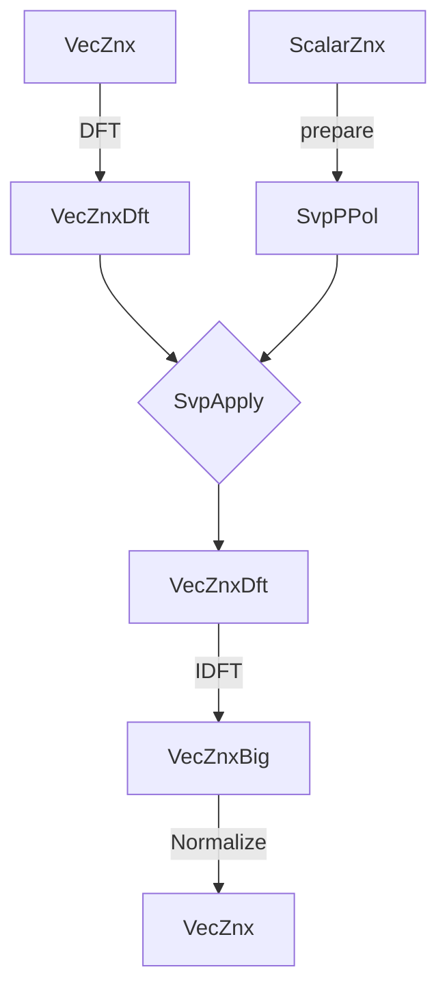

# 🐙 Poulpy-HAL

**Poulpy-HAL** is a Rust crate that provides backend-agnostic layouts and trait-based low-level lattice arithmetic matching the API of [**spqlios-arithmetic**](https://github.com/tfhe/spqlios-arithmetic). This allows developers to implement lattice-based schemes generically, with the ability to plug in optimized backends (e.g. CPU, GPU, FPGA) at runtime. Default fallbacks live in `poulpy-cpu-ref`, while `poulpy-hal` itself stays dispatch-only.

## Crate Organization

### **poulpy-hal/layouts**

This module defines backend-agnostic layouts following **spqlios-arithmetic** types. There are two main categories: user-facing types and backend types. User-facing types, such as `vec_znx`, serve as both inputs and outputs of computations, while backend types, such as `svp_ppol` (a.k.a. scalar vector product prepared polynomial), are pre-processed, write-only types stored in a backend-specific representation for optimized evaluation. For example, in the FFT64 AVX2 CPU implementation, an `svp_ppol` (the prepared form of `scalar_znx`) is stored in the DFT domain with an AVX-optimized data ordering.

This module also provides helpers over these types, as well as serialization for the front-end types `scalar_znx`, `vec_znx` and `mat_znx`.

#### Module

The `module` is a struct that stores backend-specific pre-computations (e.g. DFT tables).

#### ScalarZnx

A `scalar_znx` is a front-end, backend-agnostic type that stores a single small polynomial of `i64` coefficients. This type is mainly used to store secret keys or small plaintext polynomials (for example GGSW plaintexts).

#### VecZnx

A `vec_znx` is a front-end, backend-agnostic type that stores a vector of small polynomials (i.e. a vector of scalars). Each polynomial is a `limb` that provides an additional `base2k` bits of precision in the Torus. For example a `vec_znx` with `n`=1024, `base2k`=12, and 3 limbs can store 1024 coefficients with 36 bits of precision in the Torus. In practice, this type is used for LWE and GLWE ciphertexts/plaintexts.


#### VecZnxDft

A `vec_znx_dft` is a backend-specific type that stores a `vec_znx` in the DFT domain.


#### VecZnxBig

A `vec_znx_big` is a backend-specific type that stores a `vec_znx` with big coefficients, for example, the result of a scalar multiplication or a polynomial convolution. It can be mapped back to a `vec_znx` by applying a normalization step.


#### MatZnx

A `mat_znx` is a front-end, backend-agnostic type that stores a matrix of small polynomials (i.e. a matrix of scalars). Each row of the matrix is a `vec_znx`. In practice, this type is used for GGLWE and GGSW ciphertexts/plaintexts.


#### SvpPPol

An `svp_ppol` (scalar vector prepared polynomial) is a backend-specific type that stores a prepared `scalar_znx`. It is used to perform a scalar vector product which multiplies a `vec_znx` by a `scalar_znx`, typically when multiplying with a secret-key.

#### VmpPMat

A `vmp_pmat` (vector matrix product prepared matrix) is a backend-specific type that stores a prepared `mat_znx`. It is used to perform a vector matrix product which multiplies a `vec_znx` by a `mat_znx`, a typical step of the GLWE gadget product.

#### Scratch

A `scratch` is a backend-agnostic scratch space manager that lets you borrow bytes or structs for intermediate computations.

---------

### **poulpy-hal/api**

This module provides the user-facing traits-based API of the hardware acceleration layer. These are the traits used to implement **`poulpy-core`**, **`poulpy-ckks`** and **`poulpy-bin-fhe`**. These currently include the `module` instantiation, arithmetic over `vec_znx`, `vec_znx_big`, `vec_znx_dft`, `svp_ppol`, `vmp_pmat` and scratch space management.


---------

### **poulpy-hal/oep**

This module provides open extension points that can be implemented to provide a concrete backend to crates implementing lattice-based arithmetic using **`poulpy-hal/api`** and **`poulpy-hal/layouts`**, such as **`poulpy-core`**, **`poulpy-ckks`** and **`poulpy-bin-fhe`** or any other project/application. Poulpy-HAL itself is dispatch-only: default implementations live in `poulpy-cpu-ref`, and accelerated backends (e.g. `poulpy-cpu-avx`, `poulpy-cpu-avx512`) selectively override hot paths.


---------

### **poulpy-hal/delegates**

This module provides a link between the open extension points and public API, forwarding trait calls on `Module<BE>` to `BE`'s `HalImpl`.


---------

### Pipeline Example



### E2E Dispatch Example

User-facing call:

```rust
use poulpy_hal::api::VecZnxAddInto;
use poulpy_hal::layouts::Module;
use poulpy_cpu_avx::FFT64Avx;

let module = Module::<FFT64Avx>::new(1 << 12);
module.vec_znx_add_into(&mut res, 0, &a, 0, &b, 0);
```

Delegate in `poulpy-hal`:

```rust
impl<BE> VecZnxAddInto for Module<BE>
where
    BE: Backend + HalImpl<BE>,
{
    fn vec_znx_add_into<R, A, B>(&self, res: &mut R, res_col: usize, a: &A, a_col: usize, b: &B, b_col: usize)
    where
        R: VecZnxToMut,
        A: VecZnxToRef,
        B: VecZnxToRef,
    {
        BE::vec_znx_add_into(self, res, res_col, a, a_col, b, b_col)
    }
}
```

Backend implementation (AVX keeps defaults unless it overrides):

```rust
unsafe impl HalImpl<FFT64Avx> for FFT64Avx {
    fn vec_znx_add_into<R, A, B>(
        module: &Module<Self>,
        res: &mut R,
        res_col: usize,
        a: &A,
        a_col: usize,
        b: &B,
        b_col: usize,
    )
    where
        R: VecZnxToMut,
        A: VecZnxToRef,
        B: VecZnxToRef,
    {
        <Self as HalVecZnxDefaults<Self>>::vec_znx_add_into_default(
            module, res, res_col, a, a_col, b, b_col,
        )
    }
}
```

Defaults in `poulpy-cpu-ref`:

```rust
pub trait HalVecZnxDefaults<BE: Backend>: Backend {
    fn vec_znx_add_default<R, A, B>(
        module: &Module<BE>,
        res: &mut R,
        res_col: usize,
        a: &A,
        a_col: usize,
        b: &B,
        b_col: usize,
    )
    where
        R: VecZnxToMut,
        A: VecZnxToRef,
        B: VecZnxToRef,
        BE: ZnxAdd + ZnxCopy + ZnxZero,
    {
        reference::vec_znx::vec_znx_add_into::<R, A, B, BE>(res, res_col, a, a_col, b, b_col);
    }
}
```

## Tests

A fully generic cross-backend test suite is available in [`src/test_suite`](./src/test_suite).

## Tuning

### Transparent huge pages (Linux only)

The aligned allocator used for `VecZnx`, `VmpPMat`, and other large workspace
buffers issues `madvise(MADV_HUGEPAGE)` for allocations at or above 2 MB before
the zero-fill, which materialises the working set on 2 MB pages directly rather
than relying on `khugepaged` promotion. On large NTT/VMP workloads (e.g.
`ntt120-avx` at ring degrees ≥ 16384) this measurably reduces TLB pressure
(~5% wall-clock improvement on apply-DFT paths).

The threshold is overridable at process start via the
`POULPY_HUGEPAGE_MIN_BYTES` environment variable:

```bash
# Disable hugepage advise (e.g. on locked-down containers, cgroup'd
# environments, or hosts where THP defrag is undesirable):
POULPY_HUGEPAGE_MIN_BYTES=18446744073709551615 ./your_binary

# Lower the threshold to advise on smaller buffers:
POULPY_HUGEPAGE_MIN_BYTES=524288 ./your_binary
```

The variable is read once on first allocation and cached, so changes mid-process
have no effect. The advise call is silently ignored on failure, is a no-op on
non-Linux targets, and is a no-op on Linux hosts running with
`/sys/kernel/mm/transparent_hugepage/enabled = never`.
